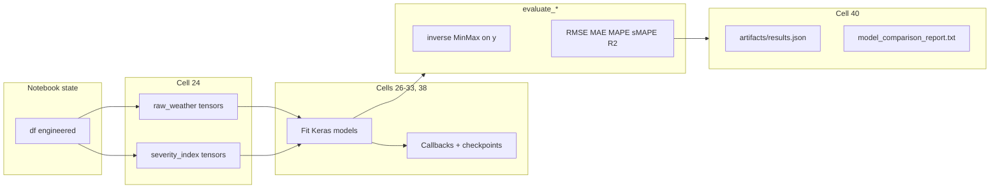

# Project Explanation — Urban Mobility Demand Forecasting

This document accompanies **`model.ipynb`**. **Preprocessing (cells 0–18)** is summarized briefly below. **The main depth is after preprocessing:** modeling setup, ablations, architectures, specialists, attention, multi-step forecasting, hyperparameter search, and how results are aggregated—written so you can defend design choices in a technical review.

---

## How to use this with your notebook

- Cells are numbered **0, 1, 2, …** (Jupyter indexing).
- Run **in order** unless noted; multi-step training (cell 36) can rebuild `multistep_ds` if prior cells already defined helpers.

---

## Part I — Data pipeline (cells 0–18) — compact summary

Everything here prepares a **single ordered table** `df` and then **tensor datasets** for Keras. The modeling section assumes you understand: no random shuffle, **24-hour input windows**, and **MinMax scaling fit on train only**.

| Block | Cells | Purpose (one line each) |
|-------|-------|-------------------------|
| Framing | 0–1 | Title + section header for preprocessing. |
| Load & types | 2–7 | Imports; read `dataset.csv` (`latin1`); parse `Date`; missing/duplicate checks; build `Datetime`; encode categories as integers. |
| Target & features | 8–11 | Target EDA; keep functioning days; cap target at 99th pct.; plot numerics; `log1p` rain/snow; correlation heatmap; drop dew point. |
| Time & FE | 12–14 | Continuity check; missing hours; calendar + cyclic time + peak flag + `weather_severity` + lags + rolling means; `dropna` + `reset_index`. |
| Split & tensors | 15–18 | **70 / 15 / 15** temporal `iloc` split; separate MinMax for `X` and `y`; `create_sequences` with **`window_size=24`** → shapes **`(N, 24, F)`** and **`(N, 1)`** labels; sanity print min/max. |

**What the first modeling code “sees”:** For the **initial** pipeline (cells 15–18), feature matrix `features` is every column except `Rented Bike Count`, `Date`, and `Datetime`. After cell 24, experiments mostly use **`datasets["raw_weather"]`** and **`datasets["severity_index"]`**, which **rebuild** splits/scalers/sequences for **fair ablation** (see below).

---

## Part II — Deep modeling and evaluation (cells 19–40) — detailed

From here onward, the notebook is a **controlled experiment**: same task (mostly **next-hour** demand), same split philosophy, same window length (**24**), comparable training budget—then it varies **feature sets**, **architectures**, **regime-specific training**, **attention**, **forecast horizon**, and optionally **hyperparameters**.

---

### Cell 19 — Markdown: “Phases 5–8”

**What:** A narrative bridge: preprocessing is done; what follows is **training**, **evaluation**, and **comparison**.

**Why it matters:** It signals a shift from tabular hygiene to **scientific comparison**: you are no longer “making numbers clean,” you are **measuring hypotheses** (which model / which features / which regime) under a shared protocol.

---

### Cell 20 — Modeling imports

**What:** Brings in **`os`**, **`time`**, **`pathlib.Path`**, **TensorFlow / Keras** (`keras`, `layers`), **`sklearn.metrics`** (`mean_absolute_error`, `mean_squared_error`, `r2_score`), and **`keras_tuner`** for the optional tuning cell.

**Why separate from cell 2:** Keeps the heavy DL dependency graph and optional tuner import **next to** the code that uses them; avoids forcing a TensorFlow import during pure EDA if you ever split the notebook.

**Practical note:** Cell 38 comments that **TensorBoard** is pulled in by Keras Tuner for trial logging; if tuning fails, check that environment satisfies Tuner’s optional logging stack.

---

### Cell 21 — Reproducibility

**What:**

- `SEED = 42`
- `tf.keras.utils.set_random_seed(SEED)` — coordinates Python, NumPy, and TF seeds where supported.
- `tf.config.experimental.enable_op_determinism()` inside `try/except` — when supported, reduces **GPU nondeterminism** (some ops have multiple valid implementations).

**Why it matters for grading / writeups:** Without seeds, two “identical” runs can differ slightly in RMSE. With seeds, **figures and tables are reproducible** on the same hardware/software stack.

**Limitation to state honestly:** Full determinism across machines (CPU vs GPU, different cuDNN versions) is not guaranteed; the notebook documents the **intent** and the **best-effort** API use.

---

### Cell 22 — Metrics, inverse scaling, artifact layout, `RESULTS`

This cell defines **how every later model is scored**, so it is worth understanding line by line.

**Directory**

- `ARTIFACT_DIR = Path("artifacts")` is created with `mkdir(parents=True, exist_ok=True)`. Checkpoints and JSON exports land here.

**Inverse scaling**

- `_to_1d` flattens predictions to a 1-D NumPy vector.
- `inverse_scale_target(y_scaled, target_scaler)` reshapes to `(n, 1)` and applies **`inverse_transform`** so RMSE/MAE are in **original bike counts**, not scaled units.

**Why inverse-transform before metrics:** MinMax on the target changes the **numerical scale** of MSE during training (fine), but **RMSE in “0.2 scaled units”** is meaningless to a domain reader. Reporting in **bikes/hour** is interpretable.

**Metric definitions (as implemented)**

| Metric | Formula / behavior in code | Interpretation for bike demand |
|--------|----------------------------|--------------------------------|
| **RMSE** | `sqrt(mean_squared_error(y_true, y_pred))` | Penalizes large errors more (squared residuals). Same units as target. |
| **MAE** | `mean_absolute_error` | Typical absolute error in bikes. Robust to occasional huge errors than RMSE. |
| **MAPE** | `mean(abs((y_true - y_pred) / (abs(y_true) + eps))) * 100` | Percent error; **unstable** when `y_true` is near 0 (hence `eps`). |
| **sMAPE** | `mean(2 * abs(y_pred - y_true) / (abs(y_true) + abs(y_pred) + eps)) * 100` | **Symmetric** bounded-ish percentage error; behaves better when true and pred are both small. |
| **R²** | `r2_score` | Fraction of variance explained vs predicting the mean; **can be negative** if the model is worse than the mean baseline. |

**`evaluate_1step_model`**

- Inputs: trained `model`, sequence tensor `X_seq`, **scaled** labels `y_seq_scaled`, the **correct** `target_scaler` for that run, `model_name`, `batch_size`.
- Steps: time `predict` → inverse-scale both true and predicted → compute metrics dict including **`inference_seconds`** (wall time for batch prediction).

**`RESULTS`**

- A **Python list of dicts** appended across the notebook. Each training/eval block pushes one or more dicts (e.g. val + test for `train_and_evaluate_1step`). The final report cell walks this list.

**Design strength you can cite:** One evaluation function + one list = **consistent metric definitions** across every architecture and split variant.

---

### Cell 23 — Markdown: Phase 3 ablation (raw weather vs `weather_severity`)

**What:** Declares two parallel feature worlds:

1. **`raw_weather`** — keep `Rainfall(mm)`, `Snowfall (cm)`, `Visibility (10m)`; **drop** the engineered composite `weather_severity`.
2. **`severity_index`** — keep `weather_severity`; **drop** those three raw columns.

**Everything else** (calendar, cyclic encodings, lags, rolls, temperatures, etc.—whatever remains in `df` after prior drops) stays the same. The **chronological 70/15/15 split** is unchanged.

**Why this is a strong “prof-level” move:** It is a **controlled ablation**: you isolate **how weather information is represented** instead of changing ten things at once. Conclusions can be phrased as: “Given our fixed preprocessing and windowing, does compressing weather into one severity index help generalization?”

---

### Cell 24 — Build `datasets` dict: splits, scalers, sequences per variant

**What `build_sequences_for_feature_cols` does (end-to-end)**

1. Takes a **list of column names** `feature_cols` (order matters: it becomes the feature dimension order in tensors).
2. Slices `df` into train / val / test by **indices** `0:train_size`, `train_size:train_size+val_size`, `train_size+val_size:` with `train_size = int(0.70 * len(df))`, `val_size = int(0.15 * len(df))`.
3. Fits **`MinMaxScaler`** on **train features only**; transforms val/test.
4. Fits a **fresh** `MinMaxScaler` on **train target**; transforms val/test targets (per variant, so no accidental scaler sharing between ablations).
5. Calls the same **`create_sequences(X_scaled, y_scaled, window_size=24)`** as earlier: for each split, sequences have length **`len(split) - window_size`**.

**Outputs stored per variant (`datasets[name]`)**

- `feature_cols`, `feature_scaler`, `target_scaler`
- `X_train_seq`, `y_train_seq`, `X_val_seq`, `y_val_seq`, `X_test_seq`, `y_test_seq`

**Tensor shapes (symbolically)**

- `X_*_seq`: `(num_sequences, 24, F_variant)` where `F_variant` differs by one-hot vs raw weather representation (printed in the cell).
- `y_*_seq`: `(num_sequences, 1)` — still **one scalar target per window**: the demand at the hour **immediately after** the 24-hour context.

**Why fresh scalers per variant:** If you reused one scaler fit on “raw” feature columns for “severity” columns, the **feature matrix dimension and semantics** would not match. Per-variant fitting is the correct experimental hygiene.

---

### Cell 25 — Markdown: Phase 5 baseline family

**What:** Names three families—**Vanilla LSTM**, **BiLSTM**, **CNN-LSTM**—each trained on **both** `raw_weather` and `severity_index`.

**Why:** Establishes a **performance ladder**: recurrent baseline → richer recurrence → hybrid conv-recurrent. Your report can show whether conv front-ends help **this** dataset (often yes when local spikes matter).

---

### Cell 26 — Training utilities and `train_and_evaluate_1step`

**Hyperparameters (fixed across Phase 5 unless you edit the cell)**

- `EPOCHS = 50`
- `BATCH_SIZE = 256`

**`make_callbacks(run_name)` returns three callbacks**

1. **`EarlyStopping`**
   - `monitor="val_loss"`
   - `patience=8` — allows eight epochs without improvement before stop.
   - `restore_best_weights=True` — after stopping, weights roll back to the **best val_loss** epoch (not the last epoch).

2. **`ReduceLROnPlateau`**
   - `monitor="val_loss"`, `factor=0.5`, `patience=4`, `min_lr=1e-6`
   - When validation loss stagnates, **halve** the learning rate so optimization can take smaller steps in a flatter region of the loss surface.

3. **`ModelCheckpoint`**
   - Saves to `artifacts/{run_name}.keras`
   - `monitor="val_loss"`, `save_best_only=True`

**`train_and_evaluate_1step(run_name, model, ds, ...)`**

1. `model.fit` on `ds["X_train_seq"]`, `ds["y_train_seq"]`, validation `(X_val_seq, y_val_seq)`, with the callbacks above.
2. **`evaluate_1step_model` on test** → dict with `split="test"`.
3. **`evaluate_1step_model` on val** → dict with `split="val"`.
4. **Appends both** to `RESULTS`.

**Why log both val and test:** Val tracks **model selection / early stopping**; test is the **held-out future** segment. Comparing them helps you discuss **overfitting** (val good, test bad) or **variance** across splits.

---

### Cell 27 — Vanilla LSTM (per variant)

**Architecture (`build_vanilla_lstm`)**

- `Input(shape=(24, F))` — 24 timesteps, `F` features.
- `LSTM(64, dropout=0.2)` — **64 units**, recurrent dropout **0.2** (drops inputs to recurrent gates during training for regularization).
- `Dense(1)` — single next-step prediction.

**Training**

- Optimizer: **Adam**, `learning_rate=1e-3`
- Loss: **MSE** (same as `keras` default for regression; aligns with RMSE on the scaled target during training).

**Run names:** `vanilla_lstm__raw_weather`, `vanilla_lstm__severity_index`.

**Role in the story:** The **simplest sequence model** that still respects temporal order. If far more complex models only beat this slightly, you have a **parsimony** argument; if they beat it clearly, you justify the added complexity.

---

### Cell 28 — Bidirectional LSTM (per variant)

**Architecture (`build_bilstm`)**

- `Bidirectional(LSTM(64, dropout=0.2))` — by default Keras **concatenates** forward and backward outputs at **each** timestep, then the layer typically **aggregates** through its internal output mode; here the LSTM feeds into `Dense(1)` after processing the full sequence (Keras returns the **last** timestep output for default `return_sequences=False`).

**Run names:** `bilstm__raw_weather`, `bilstm__severity_index`.

**Important caveat for a critical reader:** **Bidirectional** layers use information from **later** timesteps inside the **input window** when forming representations of **earlier** timesteps. That is legitimate for **offline scoring** on a fixed past window, but **strict real-time** deployment often only has the past. Your writeup can say: “BiLSTM upper-bounds what is learnable from a symmetric window; unidirectional variants would be needed for strict causal deployment.”

---

### Cell 29 — CNN-LSTM (per variant)

**Architecture (`build_cnn_lstm`)**

- `Conv1D(filters=64, kernel_size=3, padding="causal")` on the full `(24, F)` sequence.
  - **Causal** padding ensures each position only depends on **itself and previous** positions in the window—no “looking ahead” inside the 24 hours.
- `ReLU`
- `MaxPool1D(pool_size=2)` — **halves** the temporal resolution after conv (sequence length changes; LSTM sees a shorter, more abstract time axis).
- `Dropout(0.2)`
- `LSTM(64, dropout=0.2)` → `Dense(1)`

**Run names:** `cnn_lstm__raw_weather`, `cnn_lstm__severity_index`.

**Intuition:** Convolution learns **short motifs** (e.g. rapid weather-driven dips), pooling adds **local translation invariance** along time, LSTM integrates **longer context** on top of conv features.

---

### Cell 30 — Markdown: Phase 4 + 6 (specialists + attention)

**What:** Two extensions beyond “one model for all hours”:

1. **Regime specialists** — separate models trained only on **peak** vs **off-peak** **target** hours.
2. **Attention** — same CNN-LSTM spirit but with a **weighted sum over time** after an LSTM that returns **full sequences**.

---

### Cell 31 — Peak / off-peak masks (aligned to the **label** hour)

**What:** Peak hours list: **7–9** and **17–20** (matches feature engineering).

**Indexing logic (this is easy to get wrong in time series):**

- For a split spanning rows `[split_start, split_end)`, after `create_sequences` the **predicted row index** for each sequence ends at `split_start + window_size` … `split_end - 1`.
- `make_peak_mask` builds a boolean array of length **number of sequences in that split**, true when `df.iloc[target_index]["Hour"]` is in the peak list.

**Printed output:** Counts for `train_peak`, `val_peak`, `test_peak`, and complementary off-peak masks.

**Why alignment matters:** If you masked by the **start** of the window instead of the **forecasted** hour, you would train “peak model” on sequences whose **label** might be off-peak—**label noise** and invalid conclusions.

---

### Cell 32 — Peak and off-peak **specialist** CNN-LSTMs

**What:** For each `variant_name` in `datasets`:

1. **Subset** `X_train_seq`, `y_train_seq` with `train_peak` mask; same for val/test. Train `build_cnn_lstm(...)` with standard callbacks; evaluate on **`X_test_peak`** only; append metrics with `split="test_peak_only"`.
2. Repeat for **off-peak** train/val/test with `split="test_offpeak_only"`.

**Run names:** `cnn_lstm_peak_specialist__{variant}`, `cnn_lstm_offpeak_specialist__{variant}`.

**Interpretation:** You are fitting **mixture components** manually. If peak demand is driven by commute shocks and off-peak by leisure/weather, specialists can reduce **heteroscedasticity** (error structure changing by regime).

**Trade-off to mention:** At inference you need a **router** (know whether the next hour is peak) or you accept **two models** and combine by business rules—this is a **systems** cost, not just ML accuracy.

---

### Cell 33 — CNN-LSTM + **temporal attention**

**Architecture (`build_cnn_lstm_attention`)**

- Same conv / ReLU / MaxPool / Dropout stack as CNN-LSTM.
- `LSTM(..., return_sequences=True)` outputs **`(batch, time_after_pool, 64)`** — one vector per subsampled timestep.
- **Additive attention scores:** `Dense(att_units, activation="tanh")` → `Dense(1)` → **`Softmax(axis=1)`** named `att_weights` → shape **`(batch, time, 1)`**, weights **sum to 1** over time for each sample.
- **Context vector:** `keras.ops.sum(att_weights * x, axis=1)` → **`(batch, 64)`** — convex combination of LSTM outputs.
- `Dense(1)` prediction.

**Secondary model `att_model`**

- Same inputs → outputs **`att_weights`** only, for **visualization** without reimplementing forward pass by hand.

**Training**

- `ATT_VARIANT` default **`"raw_weather"`** (switch to `"severity_index"` to compare).
- Run name: `cnn_lstm_attention__{ATT_VARIANT}`.

**Heatmap readout:** For `N_SAMPLES` test sequences, the notebook plots attention rows vs time steps **after pooling** (not raw 24h indices—important caption detail for figures).

**Concept hook:** This is **soft content-based attention**: the model learns which subsampled timesteps get high weight when predicting the next demand.

---

### Cell 34 — Markdown: Phase 7 multi-step (24-hour horizon)

**What:** Changes the supervised target from a **scalar** (next hour) to a **vector** of **24 future hours** in one shot, using an **encoder–decoder** LSTM.

**Motivation:** Operations teams often care about **trajectories** (rebalancing bikes over the next day), not only \(t+1\).

---

### Cell 35 — Multi-step dataset construction

**`create_sequences_multistep(X, y, window_size=24, horizon=24)`**

- For each start index `i` up to `len(X) - window_size - horizon`, input is `X[i : i+window_size]` (shape `(24, F)`).
- Label is **`y[i+window_size : i+window_size+horizon]`** — a **length-24** slice of **future** scaled demands (column still one-dimensional per hour, stacked as a vector).

**`build_multistep_dataset`**

- Same 70/15/15 split and scaler logic as other builders.
- Returns `y_*_seq` with shape **`(N, 24, 1)`** (explicit last dimension for `TimeDistributed` dense).

**`MULTI_VARIANT`**

- Default **`"raw_weather"`** — reuses `datasets[MULTI_VARIANT]["feature_cols"]` so feature order matches the ablation branch you trust for multistep.

---

### Cell 36 — Encoder–decoder LSTM for 24-step output

**Defensive coding:** If `multistep_ds` is missing (kernel restart), it tries to rebuild from `datasets` and `build_multistep_dataset`.

**Architecture (`build_encoder_decoder_lstm`)**

- **Encoder:** `LSTM(enc_units=64, dropout=0.2, return_state=True)` → outputs `enc_out`, `state_h`, `state_c`.
- **Broadcast context:** `RepeatVector(horizon=24)(enc_out)` repeats the **encoder output vector** 24 times → gives the decoder a **template length** matching the prediction horizon (classic seq2seq pattern when not using attention between encoder and decoder).
- **Decoder:** `LSTM(dec_units=64, dropout=0.2, return_sequences=True)` initialized with **`initial_state=[state_h, state_c]`** so decoder **starts from encoder memory**.
- **Output:** `TimeDistributed(Dense(1))` applies the same dense layer **independently at each of the 24 timesteps** → shape `(batch, 24, 1)`.

**Training:** Same `EPOCHS`, `BATCH_SIZE`, `make_callbacks` pattern; run name `encdec_lstm_24step__{MULTI_VARIANT}`.

**`evaluate_24step`**

- Predicts scaled sequences, inverse-transforms **entire** `y_true` and `y_pred` by flattening to `(n*24, 1)` then reshaping to `(n, 24)`.
- Computes **RMSE for each horizon** \(h = 1..24\) separately.
- Also **overall** RMSE, MAE, R² on all flattened pairs.

**Horizon plot:** X-axis **hours ahead**, Y-axis **RMSE** — typically **non-decreasing** or gently increasing (error accumulation / harder distant future).

**What to say in a report:** This model is **not** autoregressive feedback during decoding in this implementation (decoder input is the repeated context, not previous predicted values), which avoids **exposure bias** in training but also limits certain dynamic teacher-forcing setups—reasonable simplification for a course project.

---

### Cell 37 — Markdown: Phase 8 Keras Tuner

**What:** Positions hyperparameter search as **optional** but scientifically valuable: search within a bounded budget, then compare tuned vs hand-picked CNN-LSTM.

---

### Cell 38 — `RandomSearch` over CNN-LSTM hyperparameters

**Guard:** `try/except` around `import keras_tuner as kt`; if missing, prints and skips.

**Search space (`hypermodel`)**

- `conv_filters`: `{32, 64, 96}`
- `kernel_size`: `{2, 3, 5}`
- `lstm_units`: `{32, 64, 96}`
- `dropout`: uniform in **[0.1, 0.5]** step **0.1**
- `lr`: `{1e-3, 5e-4, 1e-4}`

Each trial builds **`build_cnn_lstm`** with those hyperparameters and recompiles with **Adam(lr)**.

**Tuner configuration**

- `kt.RandomSearch`, `objective="val_loss"`, **`max_trials=10`**, `executions_per_trial=1`, `overwrite=True`
- Project directory: `artifacts/tuner/cnn_lstm_tune__{TUNE_VARIANT}`

**Search phase:** `tuner.search` with **`epochs=20`**, early stopping `patience=5` (shorter inner loop than final training).

**After search**

- Prints `best_hp.values`
- Retrieves `best_model`, optionally **fine-trains** with full `EPOCHS` + `make_callbacks` for fair comparison with Phase 5 runs.
- Evaluates on test; appends dict with `task="1step_tuned"`, `split="test"`, and embeds `best_hp` in the dict.

**Why RandomSearch (not exhaustive grid):** Grid grows **exponentially** with dimensions; random search often finds **good regions** of the space with fewer trials (Bergstra & Bengio argument you can cite briefly).

---

### Cell 39 — Markdown: final aggregation

**What:** Introduces the last code cell: flatten `RESULTS` into human-readable **tables** and machine-readable **JSON**.

---

### Cell 40 — Report writer: `model_comparison_report.txt` + `artifacts/results.json`

**Persistence**

- `RESULTS_JSON_PATH = artifacts/results.json` — **`json.dumps(rows, indent=2, default=str)`** so even non-JSON-native objects stringify instead of crashing.

**Filtering helpers**

- `_make_1step_table` keeps rows with `task` in **`{1step, 1step_tuned}`** and `split` in **`{val, test, test_peak_only, test_offpeak_only}`**.
- `_make_multistep_summary` finds the first **`task == "24step"`** and **`split == "test"`** row.

**Sorting**

- One-step rows sorted so **test-family splits** come before **val**, then by **ascending RMSE** (missing RMSE pushed to a large sentinel).

**Report sections**

1. Title + ISO timestamp.
2. **1-step** fixed-width table: model, task, split, `n`, RMSE, MAE, R², MAPE, sMAPE.
3. **24-step** block: model name, overall RMSE/MAE/R², comma-separated **RMSE per horizon**.
4. **Notes** explaining regression vs classification, R² sign, inverse scaling, MAPE vs sMAPE, and specialist subset evaluation.

**Why this cell matters academically:** It forces you to **define metrics in prose** next to numbers—exactly what graders look for when tables appear without context.

---

## End-to-end data flow (modeling phase)

---

## Concept glossary (extended)

| Term | Explanation |
|------|-------------|
| **Val vs test** | Val drives early stopping / model selection; test is the final held-out tail—never used for callback decisions in this notebook. |
| **MSE loss** | Trains the network to minimize squared error in **scaled** target space; aligns conceptually with RMSE on that scale. |
| **Causal Conv1D** | Each output time step only depends on prior input steps in the window—matches forecasting causality inside the context. |
| **MaxPool1D** | Downsamples time after convolutions; reduces compute and emphasizes **local maxima** motifs. |
| **Encoder state** | LSTM hidden + cell state summarizing the 24h input; fed into decoder as initial state in multi-step cell. |
| **RepeatVector** | Tiles the encoder summary so the decoder LSTM has a **sequence length** to unfold across 24 future slots. |
| **TimeDistributed(Dense(1))** | Same linear readout applied at each future hour independently (shared weights). |
| **Ablation** | Change exactly one modeling factor (here: weather representation) to attribute performance differences. |
| **Specialist models** | Separate estimators trained on disjoint subsets (peak vs off-peak labels). |
| **Attention weights** | Nonnegative weights summing to 1 over time; highlight which subsampled timesteps the model emphasizes. |
| **RandomSearch (tuner)** | Sample hyperparameters randomly instead of enumerating a full grid; efficient in high dimensions. |

---

## Suggested “talk track” for a professor (modeling-heavy)

1. **Protocol:** Temporal split, train-only scaling, identical windowing, metrics inverse-transformed to bikes.
2. **Hypothesis A (features):** Raw weather channels vs composite `weather_severity` (`datasets` ablation).
3. **Hypothesis B (architecture):** LSTM → BiLSTM → CNN-LSTM under the same training recipe.
4. **Hypothesis C (regimes):** Peak vs off-peak specialists—does demand heterogeneity warrant separate models?
5. **Hypothesis D (interpretability):** Attention heatmaps over the post-pooling timeline.
6. **Hypothesis E (horizon):** Encoder–decoder for **24h vector forecast** + per-horizon RMSE degradation.
7. **Hypothesis F (hparams):** RandomSearch + fine-tune vs fixed baseline CNN-LSTM.

---

*Preprocessing cells 0–18 are intentionally brief here; cells 19–40 carry the detailed narrative. Re-run the notebook to refresh `artifacts/results.json` and `model_comparison_report.txt` after code or data changes.*
